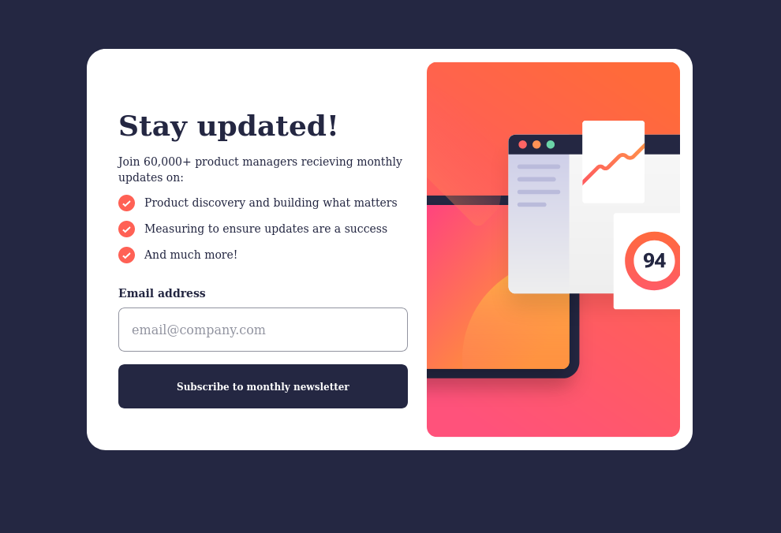
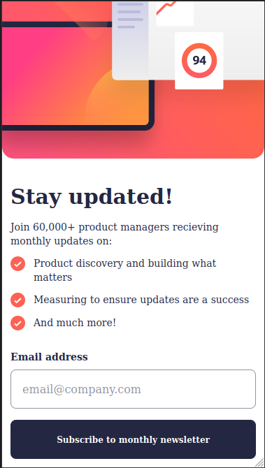

# Frontend Mentor - Newsletter sign-up form with success message solution

This is a solution to the [Newsletter sign-up form with success message challenge on Frontend Mentor](https://www.frontendmentor.io/challenges/newsletter-signup-form-with-success-message-3FC1AZbNrv). Frontend Mentor challenges help you improve your coding skills by building realistic projects.

## Table of contents

- [Overview](#overview)
  - [The challenge](#the-challenge)
  - [Screenshot](#screenshot)
  - [Links](#links)
- [My process](#my-process)
  - [Built with](#built-with)
  - [What I learned](#what-i-learned)
  - [Continued development](#continued-development)
  - [Useful resources](#useful-resources)
- [Author](#author)
- [Acknowledgments](#acknowledgments)

## Overview

### The challenge

Users should be able to:

- Add their email and submit the form
- See a success message with their email after successfully submitting the form
- See form validation messages if:
  - The field is left empty
  - The email address is not formatted correctly
- View the optimal layout for the interface depending on their device's screen size
- See hover and focus states for all interactive elements on the page

### Screenshot



- Desktop View



- Mobile View

### Links

- Solution URL: [Frontend Mentor](https://your-solution-url.com)
- Live Site URL: [Vercel](https://newsletter-signup-five-blue.vercel.app/)

## My process

### Built with

- Semantic HTML5 markup
- CSS custom properties
- Flexbox
- Tailwind CSS
- Mobile-first workflow
- Typescript
- [React](https://reactjs.org/) - JS library
- [React Hook Form](https://react-hook-form.com/get-started) - React Form Validation

### What I learned

I learned how to use the react hook form to validate user input as well as the context API to pass props data to component that directly need them without drilling props through other component, so I needed a way to render the next page whenever react hook form has validated user input upon clicking the "Subscribe to newsletter" button.

I passed a state setter function using a context provider, so when the form has been submitted and the input is valid, a certain state is updated by the form component using the state setter function provided by the context API and the "ThankYouPage" is rendered.

```ts
import { createContext } from "react";

interface IPageContext {
  setUserEmail: React.Dispatch<React.SetStateAction<string>>;
  setNextPage: React.Dispatch<React.SetStateAction<boolean>>;
}

const pageContext = createContext<IPageContext>({
  setUserEmail: () => {},
  setNextPage: () => {},
});

export default pageContext;
```

### Continued development

I will focus more on mastering advanced concepts in react such as React Router DOM, and the basics of TypeScript.

### Useful resources

- [Context API in React Article](https://www.freecodecamp.org/news/context-api-in-react/) - This article helped me understand the basics of using the context API, createContext and useContext hook .

- [React Hook Form](https://react-hook-form.com/get-started) - This helped me get started with React Hook Form and how to validate user input, cuts down on the development logic you would have to write to manage and track changes in user input

## Author

- Frontend Mentor - [@Julius-Java](https://www.frontendmentor.io/profile/julius-java)
- Twitter - [@Julius_Java00](https://www.twitter.com/julius_java00)
